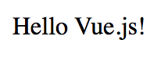

# Primeros Pasos
Para comenzar a usar vue, será necesario el uso de sus propias librerías, ya sea [npm](https://www.npmjs.com/package/vue) o añadiendo el script mediante su URL :
~~~
  https://unpkg.com/vue
~~~

Comenzamos mediante un pequeño ejemplo de holamundo:
El archivo javascript estará compuesto por una llamada a Vue que manejará el div deseado como si fuese una función de javascript (o un hash en otros lenguajes como ruby).
A partir del siguiente html podremos modificar el contenido de su div mediante una función javascript:
~~~
<body>
  

    
{{ message }}

  

</body>

~~~
** Es importante incluir los scripts al acabar el body **  
A continuación procedemos a analizar el documento js.  
Con la expresión:
~~~
 "el: '#nombre_del_div'"
 ~~~
seleccionaremos el id que le hemos asignado al div. A continuación podremos asignar un valor mediante su elemento:
~~~
"data : {
  nombreVariableHTML: 'mensaje'
}
~~~
A continuación encontramos el script completo:

~~~
new Vue({
  el: '#app',
  data: {
    message: 'Hello Vue.js!'
  }
})
~~~

Como resultado de la combinación del archivo javaScript y del HTML obtenemos:  

